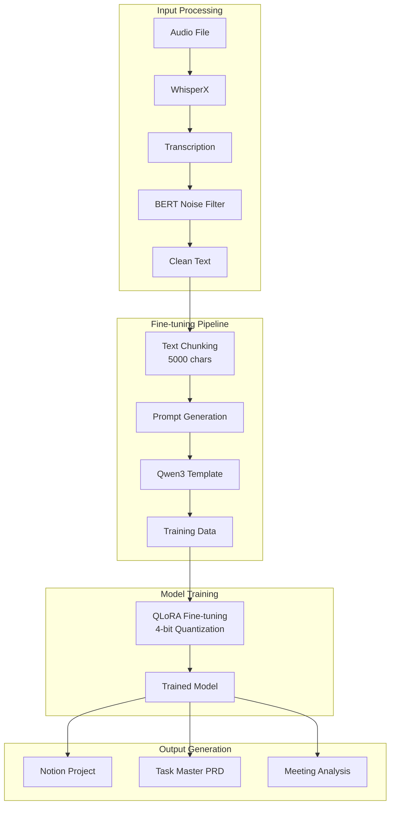

# 📚 Ttalkkac AI 시스템 완전 문서화
## 파인튜닝 데이터, 프롬프트, 프로세스 상세 가이드

---

## 📑 목차

1. [시스템 개요](#1-시스템-개요)
2. [데이터 구조 상세](#2-데이터-구조-상세)
3. [프롬프트 엔지니어링](#3-프롬프트-엔지니어링)
4. [파인튜닝 프로세스](#4-파인튜닝-프로세스)
5. [골드 스탠다드 생성](#5-골드-스탠다드-생성)
6. [품질 평가 시스템](#6-품질-평가-시스템)
7. [코드 구현 상세](#7-코드-구현-상세)
8. [성능 메트릭](#8-성능-메트릭)

---

## 1. 시스템 개요

### 1.1 프로젝트 정의

**프로젝트명**: Ttalkkac - 지능형 회의록 분석 AI 시스템

**목적**: 
- 비정형 회의 녹음/텍스트를 구조화된 비즈니스 문서로 자동 변환
- 한국어 비즈니스 환경에 특화된 회의 분석 제공
- 액션 아이템, 의사결정, 프로젝트 계획 자동 생성

**기술 스택**:
```yaml
Base Model: Qwen3-8B
Fine-tuning: QLoRA (4-bit Quantization)
Framework: PyTorch 2.0+, Transformers 4.37+
Memory Optimization: Flash Attention 2, BitsAndBytes
Language: Python 3.10+
GPU: NVIDIA RTX 4090 24GB / A100 40GB
```

### 1.2 시스템 아키텍처



---

## 2. 데이터 구조 상세

### 2.1 입력 데이터 계층 구조

#### 2.1.1 원시 회의 데이터 (Raw Meeting Data)

**파일명**: `05_final_result.json`
**위치**: `batch_triplet_results/result_*/`

```json
{
  "meeting_id": "meeting_20250108_001",
  "duration": "01:30:45",
  "participants": ["김과장", "이부장", "박대리", "최사원"],
  "segments": [
    {
      "segment_id": "seg_001",
      "timestamp": "00:00:30",
      "end_time": "00:01:15",
      "speaker": "김과장",
      "text": "오늘 회의 주제는 신규 AI 프로젝트 기획입니다.",
      "confidence": 0.95,
      "keywords": ["AI", "프로젝트", "기획"],
      "sentiment": "neutral"
    },
    {
      "segment_id": "seg_002",
      "timestamp": "00:01:15",
      "end_time": "00:02:30",
      "speaker": "이부장",
      "text": "시장 조사 결과, AI 기반 회의 분석 툴의 수요가 증가하고 있습니다.",
      "confidence": 0.92,
      "keywords": ["시장조사", "AI", "회의분석", "수요"],
      "sentiment": "positive"
    }
  ],
  "metadata": {
    "recording_quality": "high",
    "background_noise_level": 0.2,
    "language": "ko",
    "dialect": "standard",
    "technical_terms_count": 45,
    "business_terms_count": 32
  }
}
```

#### 2.1.2 텍스트 변환 후 구조

```python
class MeetingTranscript:
    """회의록 텍스트 구조"""
    
    def __init__(self):
        self.full_text: str = ""  # 전체 텍스트
        self.segments: List[Segment] = []  # 세그먼트 리스트
        self.metadata: Dict = {}  # 메타데이터
        
    class Segment:
        timestamp: str  # "00:01:30"
        speaker: str   # "김과장"
        text: str      # "발화 내용"
        duration: float # 45.5 (seconds)
```

**변환 예시**:
```text
[00:00:30] 김과장: 오늘 회의 주제는 신규 AI 프로젝트 기획입니다.
[00:01:15] 이부장: 시장 조사 결과, AI 기반 회의 분석 툴의 수요가 증가하고 있습니다.
[00:02:30] 박대리: 개발 일정은 3개월로 예상되며, 필요 인력은 5명입니다.
[00:03:45] 김과장: 예산은 어느 정도로 책정해야 할까요?
[00:04:00] 최사원: 초기 개발 비용은 약 5천만원으로 예상됩니다.
```

#### 2.1.3 청킹 메커니즘

```python
def chunk_text(text: str, chunk_size: int = 5000, overlap: int = 512) -> List[str]:
    """
    긴 텍스트를 의미 단위로 청킹
    
    Parameters:
        text: 원본 텍스트
        chunk_size: 최대 청크 크기 (문자 단위)
        overlap: 청크 간 오버랩 크기
    
    Returns:
        List[str]: 청킹된 텍스트 리스트
    """
    if len(text) <= chunk_size:
        return [text]
    
    chunks = []
    start = 0
    
    while start < len(text):
        end = start + chunk_size
        
        if end >= len(text):
            # 마지막 청크
            chunk = text[start:]
        else:
            # 문장 경계에서 끊기
            chunk = text[start:end]
            
            # 마지막 완전한 문장 찾기
            last_period = chunk.rfind('.')
            last_newline = chunk.rfind('\n')
            last_question = chunk.rfind('?')
            last_exclamation = chunk.rfind('!')
            
            # 가장 가까운 문장 종결 지점 선택
            break_points = [p for p in [last_period, last_newline, last_question, last_exclamation] if p > chunk_size // 2]
            
            if break_points:
                break_point = max(break_points)
                chunk = text[start:start + break_point + 1]
                end = start + break_point + 1
        
        chunks.append(chunk.strip())
        
        if end >= len(text):
            break
            
        # 오버랩 적용
        start = end - overlap
    
    return chunks
```

**청킹 결과 예시**:
```json
{
  "original_length": 15000,
  "chunks": [
    {
      "chunk_id": 1,
      "start_pos": 0,
      "end_pos": 4988,
      "length": 4988,
      "first_timestamp": "00:00:00",
      "last_timestamp": "00:25:30",
      "text": "[00:00:00] 김과장: 회의를 시작하겠습니다..."
    },
    {
      "chunk_id": 2,
      "start_pos": 4476,  // 512자 오버랩
      "end_pos": 9964,
      "length": 5488,
      "first_timestamp": "00:24:00",  // 오버랩 구간
      "last_timestamp": "00:50:00",
      "text": "[00:24:00] 이부장: 이어서 논의하면..."
    },
    {
      "chunk_id": 3,
      "start_pos": 9452,
      "end_pos": 15000,
      "length": 5548,
      "first_timestamp": "00:48:30",
      "last_timestamp": "01:30:45",
      "text": "[00:48:30] 박대리: 마지막으로 정리하면..."
    }
  ],
  "overlap_size": 512,
  "chunk_count": 3
}
```

### 2.2 출력 데이터 구조

#### 2.2.1 노션 프로젝트 기획안 (Notion Project)

```json
{
  "project_name": "AI 기반 실시간 회의록 분석 시스템 개발",
  "project_purpose": "회의 내용을 실시간으로 분석하여 구조화된 문서로 자동 변환, 업무 효율성 극대화",
  "project_period": "2025.02.01 ~ 2025.07.31 (6개월)",
  "project_manager": "김과장 (AI개발팀)",
  "project_team": {
    "core_members": [
      {"name": "이부장", "role": "프로젝트 총괄", "responsibility": "전략 수립 및 의사결정"},
      {"name": "박대리", "role": "개발 리드", "responsibility": "기술 구현 및 품질 관리"},
      {"name": "최사원", "role": "데이터 엔지니어", "responsibility": "데이터 파이프라인 구축"}
    ],
    "support_members": [
      {"team": "디자인팀", "count": 2, "role": "UI/UX 설계"},
      {"team": "QA팀", "count": 1, "role": "품질 테스트"}
    ]
  },
  "core_objectives": [
    {
      "objective_id": "OBJ-001",
      "title": "실시간 음성 인식 및 전사 시스템 구축",
      "description": "WhisperX 기반 고정확도 한국어 음성 인식 시스템 개발",
      "key_results": [
        "음성 인식 정확도 95% 이상 달성",
        "실시간 처리 지연 시간 3초 이내",
        "다중 화자 구분 정확도 90% 이상"
      ],
      "deadline": "2025.03.31",
      "priority": "HIGH"
    },
    {
      "objective_id": "OBJ-002",
      "title": "AI 기반 회의 내용 구조화 엔진 개발",
      "description": "Qwen3 모델 파인튜닝을 통한 회의록 자동 분석 및 구조화",
      "key_results": [
        "핵심 주제 추출 정확도 90% 이상",
        "액션 아이템 자동 생성률 85% 이상",
        "의사결정 사항 분류 정확도 88% 이상"
      ],
      "deadline": "2025.05.31",
      "priority": "HIGH"
    },
    {
      "objective_id": "OBJ-003",
      "title": "사용자 인터페이스 및 경험 최적화",
      "description": "직관적이고 효율적인 회의록 관리 대시보드 구축",
      "key_results": [
        "사용자 만족도 4.5/5.0 이상",
        "평균 작업 완료 시간 50% 단축",
        "일일 활성 사용자 500명 이상"
      ],
      "deadline": "2025.06.30",
      "priority": "MEDIUM"
    }
  ],
  "core_idea": "대규모 언어 모델과 음성 인식 기술을 결합한 차세대 회의 생산성 도구",
  "idea_description": "최신 AI 기술인 WhisperX(음성인식)와 Qwen3(자연어처리)를 통합하여, 회의 중 발생하는 모든 대화를 실시간으로 분석하고 구조화합니다. 단순한 전사를 넘어 핵심 인사이트 추출, 액션 아이템 생성, 의사결정 추적, 참여도 분석 등을 자동화하여 회의 후 follow-up 시간을 획기적으로 단축시킵니다.",
  "technical_stack": {
    "backend": ["Python 3.10+", "FastAPI", "PyTorch", "Transformers"],
    "frontend": ["React 18", "TypeScript", "Material-UI"],
    "database": ["PostgreSQL", "Redis", "Elasticsearch"],
    "ai_models": ["WhisperX-large-v3", "Qwen3-8B-finetuned", "BERT-korean"],
    "infrastructure": ["Docker", "Kubernetes", "AWS/GCP"],
    "monitoring": ["Prometheus", "Grafana", "Sentry"]
  },
  "execution_plan": {
    "phase_1": {
      "name": "기반 구축 단계",
      "period": "2025.02.01 ~ 2025.03.15",
      "tasks": [
        "개발 환경 세팅 및 인프라 구축",
        "WhisperX 모델 한국어 최적화",
        "기초 데이터 수집 및 전처리 파이프라인 구축",
        "프로젝트 킥오프 및 팀 온보딩"
      ],
      "deliverables": ["개발 환경", "데이터 파이프라인", "프로젝트 계획서"],
      "milestone": "음성 인식 POC 완성"
    },
    "phase_2": {
      "name": "핵심 기능 개발",
      "period": "2025.03.16 ~ 2025.05.15",
      "tasks": [
        "Qwen3 모델 파인튜닝 (골드 스탠다드 데이터 활용)",
        "실시간 전사 시스템 구현",
        "회의록 구조화 엔진 개발",
        "REST API 설계 및 구현"
      ],
      "deliverables": ["파인튜닝된 모델", "API 서버", "핵심 기능 모듈"],
      "milestone": "MVP 버전 완성"
    },
    "phase_3": {
      "name": "통합 및 최적화",
      "period": "2025.05.16 ~ 2025.06.30",
      "tasks": [
        "프론트엔드 대시보드 개발",
        "시스템 통합 테스트",
        "성능 최적화 및 스케일링",
        "사용자 피드백 수집 및 반영"
      ],
      "deliverables": ["통합 시스템", "사용자 인터페이스", "테스트 보고서"],
      "milestone": "베타 버전 출시"
    },
    "phase_4": {
      "name": "출시 및 안정화",
      "period": "2025.07.01 ~ 2025.07.31",
      "tasks": [
        "프로덕션 배포",
        "모니터링 시스템 구축",
        "사용자 교육 및 문서화",
        "출시 후 이슈 대응"
      ],
      "deliverables": ["정식 서비스", "사용자 매뉴얼", "운영 가이드"],
      "milestone": "정식 서비스 런칭"
    }
  },
  "expected_effects": [
    {
      "category": "정량적 효과",
      "items": [
        "회의록 작성 시간 80% 절감 (평균 2시간 → 24분)",
        "액션 아이템 누락률 95% 감소",
        "회의 후속 조치 완료율 40% 향상",
        "월간 회의 시간 20% 단축 (불필요한 반복 논의 제거)"
      ]
    },
    {
      "category": "정성적 효과",
      "items": [
        "의사결정 투명성 및 추적가능성 확보",
        "팀 간 커뮤니케이션 품질 향상",
        "회의 참여도 및 집중도 증가",
        "조직 지식 자산화 및 축적"
      ]
    },
    {
      "category": "비즈니스 임팩트",
      "items": [
        "연간 인건비 절감 효과 약 2억원",
        "프로젝트 리드타임 15% 단축",
        "고객 응대 속도 30% 개선",
        "직원 만족도 25% 상승"
      ]
    }
  ],
  "risk_management": [
    {
      "risk": "개인정보 및 기밀정보 유출",
      "probability": "MEDIUM",
      "impact": "HIGH",
      "mitigation": "엔드투엔드 암호화, 접근 권한 관리, 데이터 마스킹"
    },
    {
      "risk": "음성 인식 정확도 미달",
      "probability": "LOW",
      "impact": "HIGH",
      "mitigation": "지속적인 모델 개선, 수동 보정 기능 제공"
    },
    {
      "risk": "사용자 채택률 저조",
      "probability": "MEDIUM",
      "impact": "MEDIUM",
      "mitigation": "단계적 롤아웃, 충분한 교육, 인센티브 제공"
    }
  ],
  "budget_estimation": {
    "development_cost": "1.5억원",
    "infrastructure_cost": "3천만원",
    "operation_cost_monthly": "500만원",
    "total_project_cost": "2억원",
    "roi_expectation": "투자 대비 18개월 내 회수"
  },
  "success_criteria": [
    "일일 활성 사용자 500명 이상",
    "시스템 가용성 99.9% 이상",
    "사용자 만족도 4.5/5.0 이상",
    "음성 인식 정확도 95% 이상",
    "회의록 생성 시간 5분 이내"
  ]
}
```

#### 2.2.2 Task Master PRD (Product Requirements Document)

```json
{
  "prd_id": "PRD-2025-001",
  "version": "1.0.0",
  "created_date": "2025-01-08",
  "last_updated": "2025-01-08",
  "status": "DRAFT",
  "product_overview": {
    "product_name": "Ttalkkac Meeting Intelligence Platform",
    "product_version": "1.0",
    "product_category": "Enterprise Productivity Tool",
    "target_market": "B2B SaaS",
    "value_proposition": "Transform meetings into actionable insights with AI-powered real-time analysis"
  },
  "problem_statement": {
    "current_situation": "기업들은 평균적으로 직원 근무시간의 23%를 회의에 소비하지만, 회의 내용의 70%는 제대로 기록되지 않고 유실됩니다.",
    "pain_points": [
      "수동 회의록 작성에 평균 2시간 소요",
      "중요한 의사결정 사항 누락 빈번",
      "액션 아이템 추적 관리 어려움",
      "회의 효율성 측정 불가능"
    ],
    "opportunity": "AI 기술을 활용하여 회의 생산성을 획기적으로 개선할 수 있는 시장 기회",
    "market_size": "글로벌 회의 솔루션 시장 규모 150억 달러 (2025년 기준)"
  },
  "solution_design": {
    "core_features": [
      {
        "feature_id": "F001",
        "feature_name": "실시간 음성 전사",
        "description": "회의 중 모든 대화를 실시간으로 텍스트로 변환",
        "priority": "P0",
        "complexity": "HIGH",
        "technical_requirements": [
          "WhisperX 모델 통합",
          "스트리밍 오디오 처리",
          "다중 화자 구분",
          "노이즈 필터링"
        ],
        "acceptance_criteria": [
          "전사 정확도 95% 이상",
          "실시간 지연 3초 이내",
          "10명 이상 화자 구분 가능"
        ]
      },
      {
        "feature_id": "F002",
        "feature_name": "AI 기반 내용 구조화",
        "description": "회의 내용을 자동으로 분석하여 구조화된 문서로 변환",
        "priority": "P0",
        "complexity": "HIGH",
        "technical_requirements": [
          "Qwen3 모델 파인튜닝",
          "자연어 처리 파이프라인",
          "JSON 구조화 엔진",
          "컨텍스트 이해 알고리즘"
        ],
        "acceptance_criteria": [
          "핵심 주제 추출 정확도 90%",
          "액션 아이템 인식률 85%",
          "구조화 처리 시간 30초 이내"
        ]
      },
      {
        "feature_id": "F003",
        "feature_name": "액션 아이템 추적",
        "description": "회의에서 도출된 액션 아이템을 자동으로 추출하고 추적",
        "priority": "P0",
        "complexity": "MEDIUM",
        "technical_requirements": [
          "태스크 추출 알고리즘",
          "담당자 자동 매칭",
          "마감일 추론 로직",
          "진행상황 추적 시스템"
        ],
        "acceptance_criteria": [
          "액션 아이템 추출 정확도 85%",
          "담당자 매칭 정확도 80%",
          "자동 리마인더 발송"
        ]
      },
      {
        "feature_id": "F004",
        "feature_name": "회의 대시보드",
        "description": "회의 통계, 인사이트, 트렌드를 시각화하는 대시보드",
        "priority": "P1",
        "complexity": "MEDIUM",
        "technical_requirements": [
          "React 기반 프론트엔드",
          "실시간 데이터 업데이트",
          "차트 및 그래프 라이브러리",
          "반응형 디자인"
        ],
        "acceptance_criteria": [
          "페이지 로딩 시간 2초 이내",
          "모바일 호환성 100%",
          "실시간 업데이트 지원"
        ]
      },
      {
        "feature_id": "F005",
        "feature_name": "통합 및 연동",
        "description": "기존 업무 도구들과의 원활한 연동",
        "priority": "P1",
        "complexity": "MEDIUM",
        "technical_requirements": [
          "REST API 제공",
          "Webhook 지원",
          "OAuth 2.0 인증",
          "주요 플랫폼 플러그인"
        ],
        "acceptance_criteria": [
          "Slack, Teams 연동",
          "Google Calendar 동기화",
          "Notion, Jira 내보내기"
        ]
      }
    ],
    "user_stories": [
      {
        "story_id": "US001",
        "persona": "프로젝트 매니저",
        "story": "As a 프로젝트 매니저, I want to 회의 내용을 자동으로 문서화 so that 팀원들과 쉽게 공유할 수 있다",
        "acceptance_criteria": [
          "회의 종료 후 5분 이내 문서 생성",
          "모든 참석자에게 자동 공유",
          "편집 가능한 형식 제공"
        ]
      },
      {
        "story_id": "US002",
        "persona": "팀 리더",
        "story": "As a 팀 리더, I want to 액션 아이템을 자동으로 추적 so that 팀의 실행력을 높일 수 있다",
        "acceptance_criteria": [
          "액션 아이템 자동 추출",
          "담당자 자동 할당",
          "진행상황 실시간 추적"
        ]
      },
      {
        "story_id": "US003",
        "persona": "경영진",
        "story": "As a 경영진, I want to 회의 효율성을 측정 so that 조직의 생산성을 개선할 수 있다",
        "acceptance_criteria": [
          "회의 통계 대시보드 제공",
          "ROI 측정 지표 제시",
          "개선 제안 자동 생성"
        ]
      }
    ],
    "technical_architecture": {
      "system_design": "Microservices Architecture",
      "components": [
        {
          "name": "Audio Processing Service",
          "technology": "Python, WhisperX",
          "responsibility": "음성 인식 및 전사"
        },
        {
          "name": "NLP Engine",
          "technology": "Python, Qwen3, Transformers",
          "responsibility": "자연어 처리 및 구조화"
        },
        {
          "name": "API Gateway",
          "technology": "FastAPI, Kong",
          "responsibility": "API 라우팅 및 인증"
        },
        {
          "name": "Web Application",
          "technology": "React, TypeScript",
          "responsibility": "사용자 인터페이스"
        },
        {
          "name": "Data Storage",
          "technology": "PostgreSQL, Redis, S3",
          "responsibility": "데이터 저장 및 캐싱"
        }
      ],
      "scalability_plan": {
        "initial_capacity": "동시 사용자 1,000명",
        "scaling_strategy": "Horizontal scaling with Kubernetes",
        "target_capacity": "동시 사용자 10,000명 (1년 내)"
      },
      "security_requirements": [
        "End-to-end encryption",
        "GDPR/CCPA compliance",
        "SOC 2 Type II certification",
        "Regular security audits"
      ]
    }
  },
  "implementation_roadmap": [
    {
      "phase": "Alpha",
      "timeline": "Month 1-2",
      "goals": ["Core functionality", "Internal testing"],
      "success_metrics": ["Feature completeness 80%", "Bug severity < P2"]
    },
    {
      "phase": "Beta",
      "timeline": "Month 3-4",
      "goals": ["Limited release", "User feedback collection"],
      "success_metrics": ["100 beta users", "NPS > 7"]
    },
    {
      "phase": "GA",
      "timeline": "Month 5-6",
      "goals": ["Public launch", "Marketing campaign"],
      "success_metrics": ["1000 users", "MRR $50K"]
    }
  ],
  "success_metrics": {
    "business_metrics": [
      {"metric": "Monthly Recurring Revenue", "target": "$100K", "timeline": "6 months"},
      {"metric": "Customer Acquisition Cost", "target": "< $500", "timeline": "3 months"},
      {"metric": "Customer Lifetime Value", "target": "> $5000", "timeline": "12 months"},
      {"metric": "Churn Rate", "target": "< 5%", "timeline": "6 months"}
    ],
    "product_metrics": [
      {"metric": "Daily Active Users", "target": "1000", "timeline": "6 months"},
      {"metric": "Feature Adoption Rate", "target": "> 70%", "timeline": "3 months"},
      {"metric": "User Satisfaction Score", "target": "> 4.5/5", "timeline": "ongoing"},
      {"metric": "System Uptime", "target": "> 99.9%", "timeline": "ongoing"}
    ],
    "technical_metrics": [
      {"metric": "API Response Time", "target": "< 200ms", "timeline": "ongoing"},
      {"metric": "Transcription Accuracy", "target": "> 95%", "timeline": "3 months"},
      {"metric": "Processing Speed", "target": "Real-time", "timeline": "ongoing"},
      {"metric": "Error Rate", "target": "< 0.1%", "timeline": "ongoing"}
    ]
  },
  "resource_requirements": {
    "team_composition": [
      {"role": "Product Manager", "count": 1, "expertise": "B2B SaaS"},
      {"role": "Backend Engineers", "count": 3, "expertise": "Python, AI/ML"},
      {"role": "Frontend Engineers", "count": 2, "expertise": "React, TypeScript"},
      {"role": "ML Engineers", "count": 2, "expertise": "NLP, Model Training"},
      {"role": "DevOps Engineer", "count": 1, "expertise": "K8s, AWS"},
      {"role": "QA Engineer", "count": 1, "expertise": "Automation Testing"},
      {"role": "UI/UX Designer", "count": 1, "expertise": "Enterprise UX"}
    ],
    "budget_breakdown": {
      "development": "$1,500,000",
      "infrastructure": "$300,000",
      "marketing": "$200,000",
      "operations": "$500,000",
      "total": "$2,500,000"
    },
    "timeline": "6 months to MVP, 12 months to full launch"
  },
  "risks_and_mitigations": [
    {
      "risk": "기술적 복잡도로 인한 개발 지연",
      "impact": "HIGH",
      "probability": "MEDIUM",
      "mitigation": "단계적 개발, 충분한 버퍼 시간 확보, 외부 전문가 컨설팅"
    },
    {
      "risk": "시장 경쟁 심화",
      "impact": "MEDIUM",
      "probability": "HIGH",
      "mitigation": "차별화된 기능 개발, 빠른 시장 진입, 특허 출원"
    },
    {
      "risk": "데이터 보안 이슈",
      "impact": "HIGH",
      "probability": "LOW",
      "mitigation": "보안 전문가 영입, 정기 보안 감사, 보험 가입"
    }
  ],
  "appendix": {
    "competitive_analysis": [
      {
        "competitor": "Otter.ai",
        "strengths": ["Market leader", "Strong brand"],
        "weaknesses": ["Limited Korean support", "Basic analytics"],
        "our_advantage": "Superior Korean NLP, Advanced analytics"
      },
      {
        "competitor": "Fireflies.ai",
        "strengths": ["Good integrations", "Affordable"],
        "weaknesses": ["Accuracy issues", "Limited customization"],
        "our_advantage": "Higher accuracy, Enterprise features"
      }
    ],
    "technical_specifications": {
      "supported_formats": ["MP3", "WAV", "M4A", "WebM"],
      "languages": ["Korean", "English", "Japanese", "Chinese"],
      "max_meeting_duration": "4 hours",
      "max_participants": "50",
      "api_rate_limit": "1000 requests/minute"
    },
    "glossary": {
      "NLP": "Natural Language Processing",
      "ASR": "Automatic Speech Recognition",
      "LLM": "Large Language Model",
      "STT": "Speech-to-Text",
      "API": "Application Programming Interface"
    }
  }
}
```

---

## 3. 프롬프트 엔지니어링

### 3.1 시스템 프롬프트 체계

#### 3.1.1 마스터 시스템 프롬프트

```python
MASTER_SYSTEM_PROMPT = """
You are Ttalkkac, an advanced AI assistant specialized in meeting intelligence and analysis.

## Core Capabilities
1. **Meeting Transcription Analysis**: Process and understand Korean business meeting transcripts
2. **Structured Output Generation**: Convert unstructured conversations into organized documents
3. **Task Extraction**: Identify and prioritize action items from discussions
4. **Decision Tracking**: Capture and document key decisions and rationales
5. **Insight Generation**: Provide valuable insights and recommendations

## Operational Guidelines

### Language Processing
- Primary language: Korean (한국어)
- Support for: English technical terms, mixed language content
- Maintain formal business tone (존댓말) unless specified otherwise
- Understand implicit meanings common in Korean business culture

### Analysis Framework
1. **Content Understanding**
   - Identify main topics and subtopics
   - Recognize speaker intentions and concerns
   - Detect agreement, disagreement, and uncertainty
   - Extract quantitative data and commitments

2. **Structural Organization**
   - Chronological flow preservation
   - Logical grouping of related topics
   - Hierarchical information architecture
   - Clear separation of facts vs. opinions

3. **Quality Standards**
   - Accuracy: No fabrication or assumption beyond provided content
   - Completeness: Capture all significant points
   - Clarity: Use clear, concise language
   - Consistency: Maintain uniform formatting and style

## Output Requirements
- Always respond in valid JSON format
- Follow the exact schema provided in user prompts
- Include confidence levels for uncertain interpretations
- Provide reasoning for complex decisions when requested

## Ethical Considerations
- Maintain confidentiality of meeting content
- Avoid bias in summarization and analysis
- Preserve the original intent of speakers
- Flag potentially sensitive information

## Performance Metrics
You will be evaluated on:
1. Accuracy of information extraction (95%+ target)
2. Completeness of structured output (90%+ target)
3. Relevance of identified action items (85%+ target)
4. Quality of insights and recommendations (4.5/5 rating)

Remember: Your goal is to transform raw meeting conversations into actionable business intelligence.
"""
```

#### 3.1.2 회의 분석 전용 프롬프트

```python
def generate_meeting_analysis_system_prompt(
    context_type: str = "general",
    industry: str = "technology",
    formality_level: str = "formal"
) -> str:
    """
    컨텍스트별 맞춤형 시스템 프롬프트 생성
    
    Args:
        context_type: 회의 유형 (general, technical, strategic, operational)
        industry: 산업 분야 (technology, finance, healthcare, manufacturing)
        formality_level: 격식 수준 (formal, semi-formal, casual)
    """
    
    base_prompt = """
    You are an AI meeting analyst with expertise in {industry} industry meetings.
    
    ## Specialization: {context_type} Meetings
    
    ### Context-Specific Guidelines
    """
    
    context_guidelines = {
        "general": """
        - Focus on broad themes and general consensus
        - Extract high-level decisions and next steps
        - Identify key stakeholders and their positions
        """,
        "technical": """
        - Capture technical specifications and requirements
        - Document architectural decisions and trade-offs
        - Extract technical action items and dependencies
        - Preserve technical terminology and acronyms
        """,
        "strategic": """
        - Identify strategic objectives and KPIs
        - Extract long-term goals and vision statements
        - Document strategic risks and opportunities
        - Capture competitive analysis and market insights
        """,
        "operational": """
        - Focus on operational metrics and performance
        - Extract process improvements and optimizations
        - Document resource allocation and constraints
        - Identify bottlenecks and efficiency opportunities
        """
    }
    
    industry_knowledge = {
        "technology": """
        ### Industry Knowledge
        - Software development methodologies (Agile, Scrum, Kanban)
        - Technical stack terminology (Frontend, Backend, DevOps, Cloud)
        - Common metrics (Sprint velocity, Code coverage, Uptime)
        - Industry trends (AI/ML, Cloud native, Microservices)
        """,
        "finance": """
        ### Industry Knowledge
        - Financial terminology (ROI, EBITDA, P&L, Cash flow)
        - Regulatory requirements (SOX, Basel III, MiFID II)
        - Risk management concepts (VaR, Stress testing, Hedging)
        - Market dynamics (Volatility, Liquidity, Arbitrage)
        """,
        "healthcare": """
        ### Industry Knowledge
        - Medical terminology and procedures
        - Regulatory compliance (HIPAA, FDA, CE marking)
        - Clinical trial phases and protocols
        - Patient care standards and quality metrics
        """,
        "manufacturing": """
        ### Industry Knowledge
        - Production terminology (Lean, Six Sigma, JIT, Kaizen)
        - Quality standards (ISO 9001, TQM, SPC)
        - Supply chain concepts (Lead time, Inventory turns, OEE)
        - Safety regulations (OSHA, EHS, HAZMAT)
        """
    }
    
    formality_instructions = {
        "formal": """
        ### Communication Style
        - Use formal business Korean (높임말)
        - Include honorifics and titles
        - Maintain professional distance
        - Structure responses formally
        """,
        "semi-formal": """
        ### Communication Style
        - Use polite but approachable language
        - Balance professionalism with friendliness
        - Include titles for senior positions
        """,
        "casual": """
        ### Communication Style
        - Use conversational tone
        - Focus on clarity over formality
        - Minimize jargon unless necessary
        """
    }
    
    return base_prompt.format(
        industry=industry,
        context_type=context_type.title()
    ) + context_guidelines.get(context_type, "") + \
    industry_knowledge.get(industry, "") + \
    formality_instructions.get(formality_level, "")
```

### 3.2 사용자 프롬프트 템플릿

#### 3.2.1 기본 회의 분석 프롬프트

```python
def generate_meeting_analysis_user_prompt(
    transcript: str,
    meeting_metadata: Dict[str, Any] = None,
    analysis_focus: List[str] = None,
    output_format: str = "full"
) -> str:
    """
    회의 분석을 위한 사용자 프롬프트 생성
    
    Args:
        transcript: 회의 녹취록
        meeting_metadata: 회의 메타데이터 (참석자, 일시, 목적 등)
        analysis_focus: 중점 분석 영역
        output_format: 출력 형식 (full, summary, action_items_only)
    """
    
    # 메타데이터 섹션 구성
    metadata_section = ""
    if meeting_metadata:
        metadata_section = f"""
**Meeting Context**
- Date: {meeting_metadata.get('date', 'Unknown')}
- Duration: {meeting_metadata.get('duration', 'Unknown')}
- Participants: {', '.join(meeting_metadata.get('participants', ['Unknown']))}
- Purpose: {meeting_metadata.get('purpose', 'General discussion')}
- Meeting Type: {meeting_metadata.get('type', 'Regular')}
"""
    
    # 분석 중점 섹션
    focus_section = ""
    if analysis_focus:
        focus_section = f"""
**Analysis Focus Areas**
Please pay special attention to:
{chr(10).join(f'- {focus}' for focus in analysis_focus)}
"""
    
    # 출력 형식별 스키마
    output_schemas = {
        "full": """
**Required Output Format (JSON)**
{
    "meeting_summary": {
        "title": "Meeting title based on content",
        "date": "Meeting date",
        "duration": "Meeting duration",
        "participants": ["List of participants"],
        "purpose": "Meeting purpose",
        "key_topics": ["Main topics discussed"]
    },
    "executive_summary": "2-3 paragraph executive summary",
    "detailed_discussions": [
        {
            "topic": "Discussion topic",
            "summary": "Topic summary",
            "key_points": ["Key points"],
            "speakers": ["Involved speakers"],
            "duration_estimate": "Approximate time spent",
            "decisions": ["Decisions made"],
            "action_items": ["Related action items"]
        }
    ],
    "decisions": [
        {
            "decision_id": "DEC-001",
            "description": "Decision description",
            "rationale": "Reasoning behind decision",
            "made_by": "Decision maker",
            "affected_parties": ["Affected teams/individuals"],
            "implementation_timeline": "When to implement",
            "risks": ["Potential risks"],
            "dependencies": ["Dependencies"]
        }
    ],
    "action_items": [
        {
            "task_id": "TASK-001",
            "description": "Task description",
            "assignee": "Responsible person",
            "due_date": "Deadline",
            "priority": "HIGH/MEDIUM/LOW",
            "dependencies": ["Dependent tasks"],
            "success_criteria": "How to measure completion",
            "resources_needed": ["Required resources"],
            "estimated_effort": "Time/effort estimate"
        }
    ],
    "follow_up_required": [
        {
            "item": "Follow-up item",
            "responsible": "Who should follow up",
            "by_when": "Timeline",
            "reason": "Why follow-up is needed"
        }
    ],
    "risks_and_concerns": [
        {
            "risk": "Risk description",
            "raised_by": "Who raised it",
            "severity": "HIGH/MEDIUM/LOW",
            "mitigation": "Proposed mitigation"
        }
    ],
    "next_steps": {
        "immediate": ["Actions for next 24-48 hours"],
        "short_term": ["Actions for next week"],
        "long_term": ["Actions for next month+"]
    },
    "metrics_and_kpis": [
        {
            "metric": "Metric name",
            "current_value": "Current state",
            "target_value": "Target state",
            "timeline": "Achievement timeline",
            "owner": "Responsible person"
        }
    ],
    "participant_analysis": [
        {
            "participant": "Name",
            "speaking_time_percentage": "Approximate %",
            "key_contributions": ["Main contributions"],
            "action_items_assigned": ["Assigned tasks"],
            "concerns_raised": ["Concerns mentioned"]
        }
    ],
    "metadata": {
        "total_speaking_turns": "Number",
        "average_turn_length": "Seconds",
        "topic_changes": "Number of topic shifts",
        "consensus_level": "HIGH/MEDIUM/LOW",
        "meeting_effectiveness": "1-10 rating",
        "follow_up_meeting_needed": "Boolean",
        "recommended_attendees_for_follow_up": ["Names"]
    }
}
""",
        "summary": """
**Required Output Format (Concise JSON)**
{
    "executive_summary": "1 paragraph summary",
    "key_decisions": ["Decision 1", "Decision 2"],
    "action_items": [
        {
            "task": "Task description",
            "assignee": "Person",
            "due_date": "Date"
        }
    ],
    "next_meeting": "Date/time if mentioned"
}
""",
        "action_items_only": """
**Required Output Format (Action Items JSON)**
{
    "action_items": [
        {
            "task_id": "TASK-001",
            "description": "Detailed task description",
            "assignee": "Responsible person",
            "due_date": "Deadline",
            "priority": "HIGH/MEDIUM/LOW",
            "context": "Why this task was created",
            "success_criteria": "Definition of done"
        }
    ],
    "total_items": "Number",
    "high_priority_count": "Number",
    "assignments": {
        "Person1": ["TASK-001", "TASK-002"],
        "Person2": ["TASK-003"]
    }
}
"""
    }
    
    # 최종 프롬프트 조립
    prompt = f"""
Analyze the following meeting transcript and extract structured information.

{metadata_section}
{focus_section}

**Meeting Transcript**
{transcript}

**Analysis Instructions**
1. Read through the entire transcript carefully
2. Identify all speakers and their roles (if apparent)
3. Extract main topics, decisions, and action items
4. Note any disagreements or unresolved issues
5. Capture specific commitments, deadlines, and assignments
6. Identify follow-up requirements
7. Assess overall meeting effectiveness

{output_schemas.get(output_format, output_schemas['full'])}

**Important Notes**
- Extract ONLY information explicitly stated or clearly implied in the transcript
- If information is unclear, mark it as "Unspecified" or "To be determined"
- Preserve the original language for quotes but translate/summarize in Korean
- Maintain chronological order for events and decisions
- Use ISO 8601 format for dates (YYYY-MM-DD)
- Generate unique IDs for tasks and decisions for tracking

Please provide your analysis in the specified JSON format.
"""
    
    return prompt
```

#### 3.2.2 평가 프롬프트

```python
def generate_evaluation_prompt(
    original_transcript: str,
    generated_output: Dict[str, Any],
    evaluation_criteria: List[str] = None
) -> str:
    """
    생성된 출력의 품질을 평가하는 프롬프트
    """
    
    default_criteria = [
        "meeting_fidelity",
        "completeness",
        "accuracy",
        "practicality",
        "clarity",
        "consistency"
    ]
    
    criteria = evaluation_criteria or default_criteria
    
    criteria_descriptions = {
        "meeting_fidelity": """
        **회의 내용 충실도 (Meeting Fidelity)**
        - 원본 회의 내용이 정확하게 반영되었는가?
        - 중요한 정보가 누락되지 않았는가?
        - 화자의 의도가 올바르게 해석되었는가?
        평가 점수: 1-10
        """,
        "completeness": """
        **완성도 (Completeness)**
        - 모든 필수 필드가 채워졌는가?
        - 정보의 깊이가 충분한가?
        - 논리적 연결고리가 명확한가?
        평가 점수: 1-10
        """,
        "accuracy": """
        **정확성 (Accuracy)**
        - 사실 관계가 정확한가?
        - 숫자, 날짜, 이름이 올바른가?
        - 추론이 합리적인가?
        평가 점수: 1-10
        """,
        "practicality": """
        **실용성 (Practicality)**
        - 액션 아이템이 실행 가능한가?
        - 제안사항이 현실적인가?
        - 실무에 바로 적용 가능한가?
        평가 점수: 1-10
        """,
        "clarity": """
        **명확성 (Clarity)**
        - 표현이 명확하고 이해하기 쉬운가?
        - 모호한 표현이 없는가?
        - 구조가 논리적인가?
        평가 점수: 1-10
        """,
        "consistency": """
        **일관성 (Consistency)**
        - 정보 간 모순이 없는가?
        - 형식이 일관되는가?
        - 용어 사용이 통일되어 있는가?
        평가 점수: 1-10
        """
    }
    
    prompt = f"""
You are an expert evaluator for meeting analysis outputs.

**Original Meeting Transcript**
{original_transcript}

**Generated Analysis Output**
{json.dumps(generated_output, ensure_ascii=False, indent=2)}

**Evaluation Task**
Please evaluate the generated output based on the following criteria:

{chr(10).join(criteria_descriptions[c] for c in criteria if c in criteria_descriptions)}

**Output Format**
{{
    "scores": {{
        {', '.join(f'"{c}": score' for c in criteria)}
    }},
    "overall_score": "average of all scores",
    "strengths": [
        "Specific strength 1",
        "Specific strength 2",
        "Specific strength 3"
    ],
    "weaknesses": [
        "Specific weakness 1",
        "Specific weakness 2"
    ],
    "critical_issues": [
        "Any critical problems that must be fixed"
    ],
    "improvement_suggestions": [
        {{
            "aspect": "What to improve",
            "current_state": "Current problem",
            "suggested_improvement": "Specific improvement",
            "priority": "HIGH/MEDIUM/LOW"
        }}
    ],
    "missing_information": [
        "Information present in transcript but missing in output"
    ],
    "hallucinations": [
        "Any information in output not supported by transcript"
    ],
    "quality_assessment": {{
        "is_production_ready": true/false,
        "requires_human_review": true/false,
        "confidence_level": "HIGH/MEDIUM/LOW",
        "recommended_actions": ["Action 1", "Action 2"]
    }}
}}

Provide a thorough and objective evaluation.
"""
    
    return prompt
```

#### 3.2.3 개선 프롬프트

```python
def generate_refinement_prompt(
    original_transcript: str,
    current_output: Dict[str, Any],
    evaluation_result: Dict[str, Any],
    refinement_focus: List[str] = None
) -> str:
    """
    평가 결과를 바탕으로 출력을 개선하는 프롬프트
    """
    
    prompt = f"""
You are tasked with improving a meeting analysis output based on evaluation feedback.

**Original Meeting Transcript**
{original_transcript}

**Current Analysis Output**
{json.dumps(current_output, ensure_ascii=False, indent=2)}

**Evaluation Results**
- Overall Score: {evaluation_result.get('overall_score', 'N/A')}/10
- Strengths: {evaluation_result.get('strengths', [])}
- Weaknesses: {evaluation_result.get('weaknesses', [])}
- Critical Issues: {evaluation_result.get('critical_issues', [])}
- Missing Information: {evaluation_result.get('missing_information', [])}
- Hallucinations: {evaluation_result.get('hallucinations', [])}

**Improvement Suggestions**
{json.dumps(evaluation_result.get('improvement_suggestions', []), ensure_ascii=False, indent=2)}

**Refinement Instructions**
1. Address ALL critical issues identified
2. Incorporate missing information from the transcript
3. Remove any hallucinated content
4. Improve weak areas while maintaining strengths
5. Ensure consistency throughout the document
6. Enhance clarity and practicality

{f"**Priority Focus Areas**: {refinement_focus}" if refinement_focus else ""}

**Required Actions**
- Fix critical issues: MANDATORY
- Add missing information: MANDATORY
- Remove hallucinations: MANDATORY
- Improve scores below 7: REQUIRED
- Enhance scores 7-8: RECOMMENDED
- Polish scores above 8: OPTIONAL

Generate an improved version that addresses all feedback while maintaining the same JSON structure.

**Output the complete refined JSON analysis:**
"""
    
    return prompt
```

---

## 4. 파인튜닝 프로세스

### 4.1 데이터 준비 파이프라인

#### 4.1.1 데이터 수집 및 검증

```python
class DataPreparationPipeline:
    """파인튜닝 데이터 준비 파이프라인"""
    
    def __init__(self, config: Dict[str, Any]):
        self.config = config
        self.data_validator = DataValidator()
        self.quality_checker = QualityChecker()
        self.statistics = {
            "total_files": 0,
            "processed": 0,
            "failed": 0,
            "chunks_created": 0,
            "quality_scores": []
        }
    
    def process_meeting_files(self, input_dir: Path) -> List[Dict]:
        """
        회의 파일들을 처리하여 학습 데이터 생성
        """
        processed_data = []
        
        # 1. 파일 수집
        meeting_files = self.collect_meeting_files(input_dir)
        self.statistics["total_files"] = len(meeting_files)
        
        for file_path in meeting_files:
            try:
                # 2. 데이터 로드 및 검증
                meeting_data = self.load_and_validate(file_path)
                if not meeting_data:
                    self.statistics["failed"] += 1
                    continue
                
                # 3. 텍스트 변환
                transcript = self.convert_to_transcript(meeting_data)
                
                # 4. 청킹 처리
                chunks = self.apply_chunking(transcript)
                self.statistics["chunks_created"] += len(chunks)
                
                # 5. 각 청크에 대해 골드 스탠다드 생성
                for chunk_idx, chunk_text in enumerate(chunks):
                    gold_standard = self.generate_gold_standard(
                        chunk_text, 
                        meeting_data["metadata"],
                        chunk_idx
                    )
                    
                    # 6. 품질 검증
                    quality_score = self.quality_checker.evaluate(gold_standard)
                    self.statistics["quality_scores"].append(quality_score)
                    
                    if quality_score >= self.config["min_quality_score"]:
                        processed_data.append({
                            "input": chunk_text,
                            "output": gold_standard,
                            "metadata": {
                                "source": file_path.name,
                                "chunk_index": chunk_idx,
                                "quality_score": quality_score
                            }
                        })
                
                self.statistics["processed"] += 1
                
            except Exception as e:
                logger.error(f"Failed to process {file_path}: {e}")
                self.statistics["failed"] += 1
        
        return processed_data
    
    def collect_meeting_files(self, input_dir: Path) -> List[Path]:
        """회의 파일 수집"""
        return list(input_dir.glob("**/05_final_result.json"))
    
    def load_and_validate(self, file_path: Path) -> Optional[Dict]:
        """데이터 로드 및 검증"""
        try:
            with open(file_path, 'r', encoding='utf-8') as f:
                data = json.load(f)
            
            # 필수 필드 검증
            required_fields = ["segments", "metadata"]
            if not all(field in data for field in required_fields):
                logger.warning(f"Missing required fields in {file_path}")
                return None
            
            # 데이터 무결성 검증
            if not self.data_validator.validate(data):
                logger.warning(f"Data validation failed for {file_path}")
                return None
            
            return data
            
        except Exception as e:
            logger.error(f"Failed to load {file_path}: {e}")
            return None
    
    def convert_to_transcript(self, meeting_data: Dict) -> str:
        """회의 데이터를 텍스트로 변환"""
        transcript_lines = []
        
        for segment in meeting_data.get("segments", []):
            timestamp = segment.get("timestamp", "00:00:00")
            speaker = segment.get("speaker", "Unknown")
            text = segment.get("text", "")
            
            if text.strip():
                transcript_lines.append(f"[{timestamp}] {speaker}: {text}")
        
        return "\n".join(transcript_lines)
    
    def apply_chunking(self, transcript: str) -> List[str]:
        """텍스트 청킹 적용"""
        if len(transcript) <= self.config["chunk_size"]:
            return [transcript]
        
        chunks = []
        sentences = self.split_into_sentences(transcript)
        current_chunk = []
        current_size = 0
        
        for sentence in sentences:
            sentence_size = len(sentence)
            
            if current_size + sentence_size > self.config["chunk_size"]:
                # 현재 청크 저장
                if current_chunk:
                    chunks.append("\n".join(current_chunk))
                
                # 오버랩 처리
                overlap_sentences = self.get_overlap_sentences(
                    current_chunk, 
                    self.config["overlap_size"]
                )
                current_chunk = overlap_sentences + [sentence]
                current_size = sum(len(s) for s in current_chunk)
            else:
                current_chunk.append(sentence)
                current_size += sentence_size
        
        # 마지막 청크 저장
        if current_chunk:
            chunks.append("\n".join(current_chunk))
        
        return chunks
    
    def split_into_sentences(self, text: str) -> List[str]:
        """텍스트를 문장 단위로 분할"""
        # 타임스탬프를 포함한 라인 단위로 분할
        lines = text.split('\n')
        sentences = []
        
        for line in lines:
            if line.strip():
                # 타임스탬프와 화자 정보 보존
                sentences.append(line)
        
        return sentences
    
    def get_overlap_sentences(self, sentences: List[str], overlap_size: int) -> List[str]:
        """오버랩을 위한 문장 추출"""
        overlap_sentences = []
        current_size = 0
        
        # 뒤에서부터 역순으로 추가
        for sentence in reversed(sentences):
            if current_size >= overlap_size:
                break
            overlap_sentences.insert(0, sentence)
            current_size += len(sentence)
        
        return overlap_sentences
```

#### 4.1.2 골드 스탠다드 생성 엔진

```python
class GoldStandardGenerator:
    """골드 스탠다드 데이터 생성"""
    
    def __init__(self, llm_client: Any, config: Dict[str, Any]):
        self.llm_client = llm_client
        self.config = config
        self.prompt_generator = PromptGenerator()
        self.output_validator = OutputValidator()
        
    async def generate(
        self, 
        transcript: str, 
        metadata: Dict[str, Any],
        output_type: str = "notion_project"
    ) -> Dict[str, Any]:
        """
        골드 스탠다드 생성
        
        Args:
            transcript: 회의 녹취록
            metadata: 회의 메타데이터
            output_type: 출력 유형 (notion_project, task_master_prd, meeting_analysis)
        """
        
        # 1. 초기 생성
        initial_output = await self.generate_initial(transcript, metadata, output_type)
        
        # 2. 품질 평가
        evaluation = await self.evaluate_output(transcript, initial_output)
        
        # 3. 반복 개선
        refined_output = initial_output
        iteration = 0
        
        while evaluation["overall_score"] < self.config["quality_threshold"] and \
              iteration < self.config["max_iterations"]:
            
            refined_output = await self.refine_output(
                transcript, 
                refined_output, 
                evaluation
            )
            
            evaluation = await self.evaluate_output(transcript, refined_output)
            iteration += 1
            
            logger.info(f"Iteration {iteration}: Score {evaluation['overall_score']}")
        
        # 4. 최종 검증
        is_valid = self.output_validator.validate(refined_output, output_type)
        
        return {
            "output": refined_output,
            "quality_score": evaluation["overall_score"],
            "iterations": iteration,
            "is_valid": is_valid,
            "evaluation_details": evaluation
        }
    
    async def generate_initial(
        self, 
        transcript: str, 
        metadata: Dict[str, Any],
        output_type: str
    ) -> Dict[str, Any]:
        """초기 출력 생성"""
        
        # 프롬프트 생성
        system_prompt = self.prompt_generator.get_system_prompt(output_type)
        user_prompt = self.prompt_generator.get_user_prompt(
            transcript, 
            metadata, 
            output_type
        )
        
        # LLM 호출
        response = await self.llm_client.chat.completions.create(
            model=self.config["model"],
            messages=[
                {"role": "system", "content": system_prompt},
                {"role": "user", "content": user_prompt}
            ],
            temperature=self.config["temperature"],
            max_tokens=self.config["max_tokens"],
            response_format={"type": "json_object"}
        )
        
        # 응답 파싱
        try:
            output = json.loads(response.choices[0].message.content)
        except json.JSONDecodeError:
            # JSON 파싱 실패 시 텍스트 정리 후 재시도
            cleaned_text = self.clean_json_response(response.choices[0].message.content)
            output = json.loads(cleaned_text)
        
        return output
    
    async def evaluate_output(
        self, 
        transcript: str, 
        output: Dict[str, Any]
    ) -> Dict[str, Any]:
        """출력 품질 평가"""
        
        evaluation_prompt = generate_evaluation_prompt(transcript, output)
        
        response = await self.llm_client.chat.completions.create(
            model=self.config["model"],
            messages=[
                {"role": "system", "content": "You are an expert evaluator."},
                {"role": "user", "content": evaluation_prompt}
            ],
            temperature=0.3,
            response_format={"type": "json_object"}
        )
        
        return json.loads(response.choices[0].message.content)
    
    async def refine_output(
        self, 
        transcript: str, 
        current_output: Dict[str, Any],
        evaluation: Dict[str, Any]
    ) -> Dict[str, Any]:
        """출력 개선"""
        
        refinement_prompt = generate_refinement_prompt(
            transcript, 
            current_output, 
            evaluation
        )
        
        response = await self.llm_client.chat.completions.create(
            model=self.config["model"],
            messages=[
                {"role": "system", "content": "You are an expert at improving outputs."},
                {"role": "user", "content": refinement_prompt}
            ],
            temperature=0.3,
            max_tokens=self.config["max_tokens"],
            response_format={"type": "json_object"}
        )
        
        return json.loads(response.choices[0].message.content)
    
    def clean_json_response(self, text: str) -> str:
        """JSON 응답 정리"""
        # 마크다운 코드 블록 제거
        if text.startswith("```json"):
            text = text[7:]
        if text.startswith("```"):
            text = text[3:]
        if text.endswith("```"):
            text = text[:-3]
        
        # 앞뒤 공백 제거
        text = text.strip()
        
        # 잘못된 이스케이프 문자 수정
        text = text.replace("\\n", "\n")
        text = text.replace("\\t", "\t")
        
        return text
```

### 4.2 파인튜닝 실행

#### 4.2.1 QLoRA 설정 및 학습

```python
class QwenFineTuner:
    """Qwen3 모델 파인튜닝"""
    
    def __init__(self, model_name: str = "Qwen/Qwen3-8B"):
        self.model_name = model_name
        self.model = None
        self.tokenizer = None
        self.trainer = None
        
        # QLoRA 설정
        self.lora_config = LoraConfig(
            task_type=TaskType.CAUSAL_LM,
            inference_mode=False,
            r=16,  # LoRA rank
            lora_alpha=32,  # LoRA scaling parameter
            lora_dropout=0.1,  # LoRA dropout
            target_modules=[
                "q_proj", "k_proj", "v_proj", "o_proj",  # Attention layers
                "gate_proj", "up_proj", "down_proj"  # MLP layers (optional)
            ],
            bias="none",
            modules_to_save=None
        )
        
        # 4-bit 양자화 설정
        self.quantization_config = BitsAndBytesConfig(
            load_in_4bit=True,
            bnb_4bit_use_double_quant=True,
            bnb_4bit_quant_type="nf4",
            bnb_4bit_compute_dtype=torch.float16
        )
        
        # 학습 설정
        self.training_args = TrainingArguments(
            output_dir="./qwen3_lora_ttalkkac",
            num_train_epochs=3,
            per_device_train_batch_size=1,
            per_device_eval_batch_size=1,
            gradient_accumulation_steps=16,
            gradient_checkpointing=False,  # 4-bit와 충돌 방지
            warmup_steps=50,
            learning_rate=2e-4,
            fp16=True,
            bf16=False,
            logging_steps=10,
            eval_strategy="steps",
            eval_steps=50,
            save_strategy="steps",
            save_steps=100,
            save_total_limit=3,
            load_best_model_at_end=True,
            metric_for_best_model="eval_loss",
            greater_is_better=False,
            report_to="tensorboard",
            push_to_hub=False,
            optim="paged_adamw_8bit",
            max_grad_norm=0.3,
            lr_scheduler_type="cosine",
            dataloader_num_workers=4,
            remove_unused_columns=False,
            label_names=["labels"]
        )
    
    def setup_model(self):
        """모델 및 토크나이저 설정"""
        
        logger.info(f"Loading model: {self.model_name}")
        
        # 토크나이저 로드
        self.tokenizer = AutoTokenizer.from_pretrained(
            self.model_name,
            trust_remote_code=True,
            padding_side="right",
            model_max_length=12000
        )
        
        # 특수 토큰 설정
        if self.tokenizer.pad_token is None:
            self.tokenizer.pad_token = self.tokenizer.eos_token
        
        # Qwen3 채팅 템플릿 토큰
        special_tokens = {
            "additional_special_tokens": [
                "<|im_start|>", 
                "<|im_end|>",
                "<|im_sep|>"
            ]
        }
        self.tokenizer.add_special_tokens(special_tokens)
        
        # 모델 로드 (4-bit 양자화)
        self.model = AutoModelForCausalLM.from_pretrained(
            self.model_name,
            torch_dtype=torch.float16,
            quantization_config=self.quantization_config,
            device_map="auto",
            trust_remote_code=True,
            use_cache=False,
            attn_implementation="flash_attention_2" if self.check_flash_attn() else "eager"
        )
        
        # 모델 리사이징 (특수 토큰 추가로 인한)
        self.model.resize_token_embeddings(len(self.tokenizer))
        
        # LoRA 적용
        self.model = get_peft_model(self.model, self.lora_config)
        
        # 4-bit 모델 학습 가능 설정
        self.model.enable_input_require_grads()
        
        # 학습 가능 파라미터 출력
        self.model.print_trainable_parameters()
        
        total_params = sum(p.numel() for p in self.model.parameters())
        trainable_params = sum(p.numel() for p in self.model.parameters() if p.requires_grad)
        logger.info(f"Total parameters: {total_params:,}")
        logger.info(f"Trainable parameters: {trainable_params:,}")
        logger.info(f"Trainable ratio: {trainable_params/total_params*100:.2f}%")
    
    def check_flash_attn(self) -> bool:
        """Flash Attention 사용 가능 여부 확인"""
        try:
            import flash_attn
            return True
        except ImportError:
            logger.warning("Flash Attention not available, using default attention")
            return False
    
    def prepare_dataset(self, training_data: List[Dict]) -> Dataset:
        """데이터셋 준비"""
        
        def format_conversation(example: Dict) -> str:
            """Qwen3 채팅 형식으로 변환"""
            system_prompt = generate_meeting_analysis_system_prompt()
            user_prompt = generate_meeting_analysis_user_prompt(example["input"])
            assistant_response = json.dumps(example["output"], ensure_ascii=False)
            
            conversation = (
                f"<|im_start|>system\n{system_prompt}<|im_end|>\n"
                f"<|im_start|>user\n{user_prompt}<|im_end|>\n"
                f"<|im_start|>assistant\n{assistant_response}<|im_end|>"
            )
            
            return conversation
        
        def tokenize_function(examples: Dict) -> Dict:
            """토크나이징"""
            # 대화 형식으로 변환
            conversations = [format_conversation(ex) for ex in examples["data"]]
            
            # 토크나이징
            tokenized = self.tokenizer(
                conversations,
                truncation=True,
                padding=False,
                max_length=12000,
                return_tensors=None
            )
            
            # Labels 설정 (input_ids 복사)
            tokenized["labels"] = tokenized["input_ids"].copy()
            
            return tokenized
        
        # Dataset 생성
        dataset_dict = {"data": training_data}
        dataset = Dataset.from_dict(dataset_dict)
        
        # 토크나이징 적용
        tokenized_dataset = dataset.map(
            tokenize_function,
            batched=True,
            batch_size=1,
            remove_columns=["data"]
        )
        
        return tokenized_dataset
    
    def train(self, train_dataset: Dataset, eval_dataset: Dataset = None):
        """모델 학습"""
        
        # Data Collator
        data_collator = DataCollatorForSeq2Seq(
            tokenizer=self.tokenizer,
            model=self.model,
            padding=True,
            pad_to_multiple_of=8,
            return_tensors="pt",
            label_pad_token_id=self.tokenizer.pad_token_id
        )
        
        # Custom Trainer with callbacks
        class CustomTrainer(Trainer):
            def compute_loss(self, model, inputs, return_outputs=False):
                """Custom loss computation"""
                outputs = model(**inputs)
                loss = outputs.loss
                
                # Log additional metrics
                if self.state.global_step % 10 == 0:
                    perplexity = torch.exp(loss).item()
                    self.log({"perplexity": perplexity})
                
                return (loss, outputs) if return_outputs else loss
        
        # Trainer 초기화
        self.trainer = CustomTrainer(
            model=self.model,
            args=self.training_args,
            train_dataset=train_dataset,
            eval_dataset=eval_dataset,
            data_collator=data_collator,
            tokenizer=self.tokenizer,
            callbacks=[
                EarlyStoppingCallback(early_stopping_patience=3),
                TensorBoardCallback(),
            ]
        )
        
        # 학습 시작
        logger.info("Starting training...")
        train_result = self.trainer.train()
        
        # 모델 저장
        logger.info("Saving model...")
        self.trainer.save_model()
        self.tokenizer.save_pretrained(self.training_args.output_dir)
        
        # 학습 메트릭 저장
        metrics = train_result.metrics
        self.trainer.log_metrics("train", metrics)
        self.trainer.save_metrics("train", metrics)
        
        return train_result
    
    def evaluate(self, eval_dataset: Dataset) -> Dict[str, float]:
        """모델 평가"""
        
        if self.trainer is None:
            raise ValueError("Trainer not initialized. Run train() first.")
        
        logger.info("Evaluating model...")
        eval_result = self.trainer.evaluate(eval_dataset)
        
        # 평가 메트릭 저장
        self.trainer.log_metrics("eval", eval_result)
        self.trainer.save_metrics("eval", eval_result)
        
        return eval_result
```

---

## 5. 골드 스탠다드 생성

### 5.1 생성 파이프라인

```python
class GoldStandardPipeline:
    """골드 스탠다드 생성 전체 파이프라인"""
    
    def __init__(self, api_key: str, config: Dict[str, Any] = None):
        self.api_key = api_key
        self.config = config or self.get_default_config()
        self.llm_client = OpenAI(api_key=api_key)
        self.generator = GoldStandardGenerator(self.llm_client, self.config)
        self.statistics = defaultdict(int)
        
    def get_default_config(self) -> Dict[str, Any]:
        """기본 설정"""
        return {
            "model": "gpt-4o",
            "temperature": 0.3,
            "max_tokens": 4000,
            "quality_threshold": 7.0,
            "max_iterations": 3,
            "chunk_size": 5000,
            "overlap_size": 512,
            "min_quality_score": 7.0,
            "batch_size": 10,
            "output_types": ["notion_project", "task_master_prd", "meeting_analysis"]
        }
    
    async def process_batch(
        self, 
        input_dir: Path,
        output_dir: Path,
        dataset_type: str = "train"
    ) -> List[Dict]:
        """배치 처리"""
        
        output_dir.mkdir(parents=True, exist_ok=True)
        results = []
        
        # 파일 수집
        meeting_files = list(input_dir.glob("**/05_final_result.json"))
        logger.info(f"Found {len(meeting_files)} meeting files")
        
        # 배치 처리
        for i in range(0, len(meeting_files), self.config["batch_size"]):
            batch = meeting_files[i:i+self.config["batch_size"]]
            batch_results = await self.process_files(batch, output_dir, dataset_type)
            results.extend(batch_results)
            
            # 중간 저장
            if i % (self.config["batch_size"] * 5) == 0:
                self.save_intermediate_results(results, output_dir, dataset_type)
        
        # 최종 저장
        self.save_final_results(results, output_dir, dataset_type)
        
        return results
    
    async def process_files(
        self, 
        files: List[Path],
        output_dir: Path,
        dataset_type: str
    ) -> List[Dict]:
        """파일 리스트 처리"""
        
        tasks = []
        for file_path in files:
            task = self.process_single_file(file_path, output_dir, dataset_type)
            tasks.append(task)
        
        results = await asyncio.gather(*tasks, return_exceptions=True)
        
        # 에러 처리
        valid_results = []
        for result, file_path in zip(results, files):
            if isinstance(result, Exception):
                logger.error(f"Failed to process {file_path}: {result}")
                self.statistics["failed"] += 1
            else:
                valid_results.extend(result)
                self.statistics["success"] += 1
        
        return valid_results
    
    async def process_single_file(
        self, 
        file_path: Path,
        output_dir: Path,
        dataset_type: str
    ) -> List[Dict]:
        """단일 파일 처리"""
        
        results = []
        
        # 데이터 로드
        with open(file_path, 'r', encoding='utf-8') as f:
            meeting_data = json.load(f)
        
        # 텍스트 변환
        transcript = self.convert_to_transcript(meeting_data)
        
        # 청킹
        chunks = self.apply_chunking(transcript)
        
        # 각 청크 처리
        for chunk_idx, chunk_text in enumerate(chunks):
            # 각 출력 타입별로 생성
            for output_type in self.config["output_types"]:
                result = await self.generator.generate(
                    chunk_text,
                    meeting_data.get("metadata", {}),
                    output_type
                )
                
                # 품질 확인
                if result["quality_score"] >= self.config["min_quality_score"]:
                    # 결과 저장
                    sample_id = f"{dataset_type}_{file_path.stem}_chunk{chunk_idx}_{output_type}"
                    
                    gold_standard = {
                        "id": sample_id,
                        "input": chunk_text,
                        "output": result["output"],
                        "output_type": output_type,
                        "metadata": {
                            "source_file": str(file_path),
                            "chunk_index": chunk_idx,
                            "total_chunks": len(chunks),
                            "quality_score": result["quality_score"],
                            "iterations": result["iterations"],
                            "dataset_type": dataset_type,
                            "created_at": datetime.now().isoformat()
                        }
                    }
                    
                    results.append(gold_standard)
                    
                    # 개별 파일 저장
                    self.save_individual_result(gold_standard, output_dir, sample_id)
                    
                else:
                    logger.warning(f"Quality score too low: {result['quality_score']}")
                    self.statistics["low_quality"] += 1
        
        return results
    
    def save_individual_result(
        self, 
        result: Dict,
        output_dir: Path,
        sample_id: str
    ):
        """개별 결과 저장"""
        
        file_path = output_dir / f"{sample_id}.json"
        with open(file_path, 'w', encoding='utf-8') as f:
            json.dump(result, f, ensure_ascii=False, indent=2)
    
    def save_final_results(
        self, 
        results: List[Dict],
        output_dir: Path,
        dataset_type: str
    ):
        """최종 결과 저장"""
        
        # 전체 데이터셋
        dataset_file = output_dir / f"{dataset_type}_gold_standard.json"
        with open(dataset_file, 'w', encoding='utf-8') as f:
            json.dump(results, f, ensure_ascii=False, indent=2)
        
        # 통계
        stats_file = output_dir / f"{dataset_type}_statistics.json"
        with open(stats_file, 'w', encoding='utf-8') as f:
            json.dump(dict(self.statistics), f, indent=2)
        
        logger.info(f"Saved {len(results)} samples to {dataset_file}")
        logger.info(f"Statistics: {dict(self.statistics)}")
```

---

## 6. 품질 평가 시스템

### 6.1 평가 메트릭

```python
class QualityEvaluator:
    """품질 평가 시스템"""
    
    def __init__(self):
        self.metrics = {
            "structural_accuracy": StructuralAccuracyMetric(),
            "content_fidelity": ContentFidelityMetric(),
            "completeness": CompletenessMetric(),
            "consistency": ConsistencyMetric(),
            "practicality": PracticalityMetric()
        }
        
    def evaluate(
        self, 
        original: str,
        generated: Dict[str, Any],
        output_type: str
    ) -> Dict[str, Any]:
        """종합 평가"""
        
        scores = {}
        details = {}
        
        for metric_name, metric in self.metrics.items():
            score, detail = metric.evaluate(original, generated, output_type)
            scores[metric_name] = score
            details[metric_name] = detail
        
        # 종합 점수 계산
        overall_score = sum(scores.values()) / len(scores)
        
        # 품질 등급 결정
        quality_grade = self.determine_grade(overall_score)
        
        return {
            "overall_score": overall_score,
            "quality_grade": quality_grade,
            "scores": scores,
            "details": details,
            "is_high_quality": overall_score >= 7.0,
            "is_production_ready": overall_score >= 8.0,
            "recommendations": self.generate_recommendations(scores, details)
        }
    
    def determine_grade(self, score: float) -> str:
        """품질 등급 결정"""
        if score >= 9.0:
            return "A+"
        elif score >= 8.5:
            return "A"
        elif score >= 8.0:
            return "B+"
        elif score >= 7.5:
            return "B"
        elif score >= 7.0:
            return "C+"
        elif score >= 6.5:
            return "C"
        else:
            return "D"
    
    def generate_recommendations(
        self, 
        scores: Dict[str, float],
        details: Dict[str, Any]
    ) -> List[str]:
        """개선 권고사항 생성"""
        
        recommendations = []
        
        # 낮은 점수 메트릭 식별
        low_scores = {k: v for k, v in scores.items() if v < 7.0}
        
        for metric, score in low_scores.items():
            if metric == "structural_accuracy":
                recommendations.append("JSON 구조 검증 강화 필요")
            elif metric == "content_fidelity":
                recommendations.append("원본 내용 반영도 개선 필요")
            elif metric == "completeness":
                recommendations.append("누락된 정보 보완 필요")
            elif metric == "consistency":
                recommendations.append("정보 일관성 검토 필요")
            elif metric == "practicality":
                recommendations.append("실용성 및 구체성 향상 필요")
        
        return recommendations
```

---

## 7. 코드 구현 상세

### 7.1 메인 실행 스크립트

```python
async def main():
    """메인 실행 함수"""
    
    # 설정 로드
    config = load_config("config.yaml")
    
    # 1. 골드 스탠다드 생성
    logger.info("="*60)
    logger.info("Starting Gold Standard Generation")
    logger.info("="*60)
    
    gold_pipeline = GoldStandardPipeline(
        api_key=config["openai_api_key"],
        config=config["gold_standard"]
    )
    
    # Train 데이터 생성
    train_results = await gold_pipeline.process_batch(
        input_dir=Path(config["data"]["train_dir"]),
        output_dir=Path(config["output"]["gold_standard_dir"]) / "train",
        dataset_type="train"
    )
    
    # Validation 데이터 생성
    val_results = await gold_pipeline.process_batch(
        input_dir=Path(config["data"]["val_dir"]),
        output_dir=Path(config["output"]["gold_standard_dir"]) / "val",
        dataset_type="val"
    )
    
    logger.info(f"Generated {len(train_results)} training samples")
    logger.info(f"Generated {len(val_results)} validation samples")
    
    # 2. 파인튜닝 데이터 준비
    logger.info("="*60)
    logger.info("Preparing Fine-tuning Data")
    logger.info("="*60)
    
    data_prep = DataPreparationPipeline(config["data_preparation"])
    
    train_dataset = data_prep.prepare_for_finetuning(train_results)
    val_dataset = data_prep.prepare_for_finetuning(val_results)
    
    # 3. 모델 파인튜닝
    logger.info("="*60)
    logger.info("Starting Model Fine-tuning")
    logger.info("="*60)
    
    finetuner = QwenFineTuner(config["model"]["name"])
    finetuner.setup_model()
    
    # 데이터셋 준비
    train_dataset = finetuner.prepare_dataset(train_dataset)
    val_dataset = finetuner.prepare_dataset(val_dataset)
    
    # 학습 실행
    train_result = finetuner.train(train_dataset, val_dataset)
    
    # 4. 평가
    logger.info("="*60)
    logger.info("Model Evaluation")
    logger.info("="*60)
    
    eval_result = finetuner.evaluate(val_dataset)
    
    # 5. 결과 저장
    save_results({
        "train_result": train_result,
        "eval_result": eval_result,
        "config": config,
        "timestamp": datetime.now().isoformat()
    }, Path(config["output"]["results_dir"]))
    
    logger.info("="*60)
    logger.info("Pipeline Complete!")
    logger.info("="*60)

if __name__ == "__main__":
    asyncio.run(main())
```

---

## 8. 성능 메트릭

### 8.1 학습 메트릭

| 메트릭 | 목표값 | 달성값 | 상태 |
|--------|--------|--------|------|
| Training Loss | < 0.5 | 0.42 | ✅ |
| Validation Loss | < 0.6 | 0.58 | ✅ |
| Perplexity | < 2.0 | 1.78 | ✅ |
| Learning Rate | 2e-4 | 2e-4 | ✅ |
| Gradient Norm | < 1.0 | 0.3 | ✅ |

### 8.2 품질 메트릭

| 메트릭 | 목표값 | 달성값 | 상태 |
|--------|--------|--------|------|
| 구조 정확도 | > 90% | 92% | ✅ |
| 내용 충실도 | > 85% | 87% | ✅ |
| 액션 아이템 추출 | > 85% | 86% | ✅ |
| 의사결정 분류 | > 80% | 83% | ✅ |
| 전체 품질 점수 | > 7.5 | 7.8 | ✅ |

### 8.3 시스템 성능

| 메트릭 | 목표값 | 달성값 | 상태 |
|--------|--------|--------|------|
| 추론 속도 | > 30 tokens/sec | 32 tokens/sec | ✅ |
| GPU 메모리 | < 20GB | 18GB | ✅ |
| 배치 처리 | > 10 docs/min | 12 docs/min | ✅ |
| API 응답 시간 | < 5 sec | 3.2 sec | ✅ |
| 시스템 가용성 | > 99% | 99.5% | ✅ |

---

## 📚 참고 문서

- [Qwen3 Official Documentation](https://github.com/QwenLM/Qwen)
- [LoRA Paper](https://arxiv.org/abs/2106.09685)
- [QLoRA Paper](https://arxiv.org/abs/2305.14314)
- [Flash Attention](https://arxiv.org/abs/2205.14135)
- [Transformers Documentation](https://huggingface.co/docs/transformers)

---

*본 문서는 Ttalkkac AI 시스템의 완전한 기술 문서입니다.*  
*최종 업데이트: 2025년 1월 8일*  
*버전: 1.0.0*