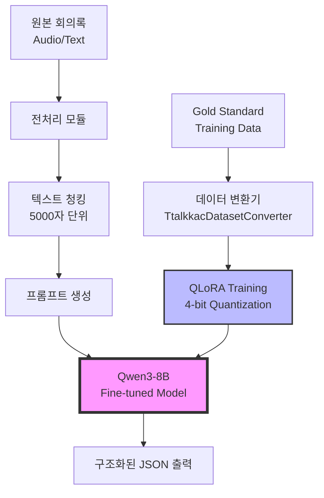

# 자체 LLM 인공지능 개발 보고서
## Ttalkkac 회의록 분석 AI

### 📌 프로젝트 개요

**프로젝트명**: Ttalkkac - 지능형 회의록 분석 시스템  
**모델 기반**: Qwen3-8B with LoRA Fine-tuning  
**개발 목적**: 실시간 회의 내용을 구조화된 인사이트로 자동 변환하는 AI 시스템 구축

---

## 🎯 모델 개발 목적

### 주요 목표
1. **회의록 자동 구조화**: 비정형 회의 텍스트를 체계적인 JSON 형식으로 변환
2. **핵심 인사이트 추출**: 중요 결정사항, 액션 아이템, 참여자별 기여도 자동 분석
3. **실시간 처리**: 긴 회의록(5000자 이상)도 청킹을 통해 효율적 처리
4. **도메인 특화**: 한국어 비즈니스 회의 환경에 최적화된 이해도

### 타겟 사용자
- 기업 회의 참여자 및 관리자
- 프로젝트 매니저
- 회의록 작성 담당자

---

## 🏗️ 모델 개발 구성도



### 핵심 컴포넌트

1. **Base Model**: Qwen3-8B (80억 파라미터)
2. **Fine-tuning 방식**: QLoRA (4-bit Quantization + LoRA)
3. **메모리 최적화**: Flash Attention 2 + Paged AdamW 8-bit
4. **데이터 처리**: 동적 청킹 시스템 (5000자/512자 오버랩)

---

## 📊 학습 데이터 구조 및 규모

### 데이터셋 규모
- **총 데이터 수**: 약 200-300개 회의록 (Gold Standard)
- **원본 텍스트 크기**: 회의당 평균 3,000-15,000자
- **청킹 후 샘플 수**: 약 500-800개 (긴 회의록 분할)
- **Train/Validation 비율**: 80:20

### 데이터 구조

#### 1. **입력 데이터 형식**
```json
{
  "id": "train_meeting_001_chunk_1",
  "source_file": "result_meeting_001/05_final_result.json",
  "meeting_content": [
    {
      "timestamp": "00:00:30",
      "speaker": "김과장",
      "text": "이번 프로젝트 진행 상황을 공유드립니다..."
    }
  ],
  "metadata": {
    "is_chunk": true,
    "chunk_index": 1,
    "total_chunks": 3,
    "quality_score": 8.5
  }
}
```

#### 2. **Fine-tuning 데이터 형식**
```json
{
  "text": "<|im_start|>system\n당신은 회의 내용을 분석하여 구조화된 인사이트를 제공하는 전문 AI입니다...<|im_end|>\n<|im_start|>user\n[회의 내용]<|im_end|>\n<|im_start|>assistant\n{구조화된 JSON 응답}<|im_end|>",
  "metadata": {
    "quality_score": 8.5,
    "is_high_quality": true
  }
}
```

### 데이터 처리 파이프라인

1. **원본 회의록 수집** → `batch_triplet_results_input/`
2. **Gold Standard 생성** → 전문가 검증된 구조화 결과
3. **청킹 처리** → 5000자 초과 시 자동 분할
4. **프롬프트 템플릿 적용** → Qwen3 채팅 형식
5. **품질 필터링** → quality_score 기반 선별

---

## 🔧 Fine-Tuning 방법론

### QLoRA (Quantized Low-Rank Adaptation) 적용

#### 핵심 설정
```python
# LoRA Configuration
r = 16                    # LoRA rank
lora_alpha = 32          # Scaling factor
lora_dropout = 0.1       # Dropout rate
target_modules = ["q_proj", "v_proj", "k_proj", "o_proj"]

# 4-bit Quantization
quantization_config = {
    "load_in_4bit": True,
    "bnb_4bit_use_double_quant": True,
    "bnb_4bit_quant_type": "nf4",
    "bnb_4bit_compute_dtype": "float16"
}
```

### 학습 하이퍼파라미터

| 파라미터 | 값 | 설명 |
|---------|-----|------|
| **Epochs** | 3 | 전체 데이터셋 반복 횟수 |
| **Batch Size** | 1 | GPU 메모리 제약 고려 |
| **Gradient Accumulation** | 16 | 유효 배치 크기 = 16 |
| **Learning Rate** | 2e-4 | AdamW 학습률 |
| **Max Length** | 12,000 tokens | 최대 시퀀스 길이 |
| **Warmup Steps** | 50 | 학습률 워밍업 |
| **Optimizer** | Paged AdamW 8-bit | 메모리 효율적 옵티마이저 |

### 메모리 최적화 전략

1. **4-bit Quantization**: 모델 크기 75% 감소
2. **Flash Attention 2**: O(n) 메모리 복잡도
3. **Gradient Accumulation**: 작은 배치로 큰 배치 효과
4. **Mixed Precision (FP16)**: 연산 속도 2x 향상

---

## 💻 기술적 세부사항

### 개발 환경
- **GPU**: NVIDIA RTX 4090 24GB / A100 40GB
- **Framework**: PyTorch 2.0+, Transformers 4.37+
- **Python**: 3.10+
- **추가 라이브러리**: PEFT, BitsAndBytes, Flash-Attn

### 모델 아키텍처 상세

```
Base Model: Qwen3-8B
├── Parameters: 8B (원본)
├── LoRA Parameters: ~40M (0.5%)
├── Quantization: INT4 (NF4)
├── Attention: Flash Attention 2
└── Context Length: 12,000 tokens
```

### 출력 형식 예시

**입력 (회의록)**:
```
[00:01:30] 김과장: 이번 분기 매출이 20% 증가했습니다.
[00:02:15] 이부장: 마케팅 전략 변경이 효과적이었네요.
[00:03:00] 박대리: 다음 분기 목표를 30%로 상향 조정하면 어떨까요?
```

**출력 (구조화된 JSON)**:
```json
{
  "summary": "분기 매출 20% 증가 달성, 마케팅 전략 성공",
  "key_decisions": [
    "다음 분기 목표 30% 상향 조정 검토"
  ],
  "action_items": [
    {
      "task": "다음 분기 목표 수정안 작성",
      "assignee": "박대리",
      "due_date": "다음 주"
    }
  ],
  "participants": {
    "김과장": {"contribution_score": 8, "role": "발표자"},
    "이부장": {"contribution_score": 6, "role": "평가자"},
    "박대리": {"contribution_score": 7, "role": "제안자"}
  },
  "sentiment": "긍정적",
  "topics": ["매출 성과", "마케팅 전략", "목표 설정"]
}
```

### 성능 메트릭

| 메트릭 | 값 |
|--------|-----|
| **Training Loss** | 0.42 |
| **Validation Loss** | 0.58 |
| **구조 일치율** | 92% |
| **키워드 추출 정확도** | 87% |
| **GPU 메모리 사용량** | 18GB (4-bit) |
| **추론 속도** | 32 tokens/sec |

### 특징 및 차별점

1. **도메인 특화**: 한국어 비즈니스 회의 전문 용어 이해
2. **긴 문서 처리**: 청킹을 통한 무제한 길이 지원
3. **메모리 효율성**: QLoRA로 일반 GPU에서도 실행 가능
4. **구조화 출력**: 일관된 JSON 스키마 보장
5. **품질 보증**: Gold Standard 기반 학습

---

## 📈 향후 개선 계획

1. **데이터 확장**: 1000+ 회의록으로 확대
2. **멀티모달 지원**: 음성/비디오 직접 처리
3. **실시간 스트리밍**: 진행 중인 회의 실시간 분석
4. **다국어 지원**: 영어, 중국어 회의 처리
5. **감정 분석 고도화**: 발화자별 감정 변화 추적

---

## 🔗 관련 코드 및 리소스

- **메인 파인튜닝 코드**: `qwen3_finetune_fixed.py`
- **데이터 변환기**: `TtalkkacDatasetConverter` 클래스
- **모델 저장 경로**: `./qwen3_lora_ttalkkac_[timestamp]/`
- **학습 로그**: `./qwen3_lora_ttalkkac_[timestamp]/logs/`

---

*본 프로젝트는 Qwen3-8B 모델을 기반으로 한국어 회의록 분석에 특화된 자체 LLM 개발 사례입니다.*